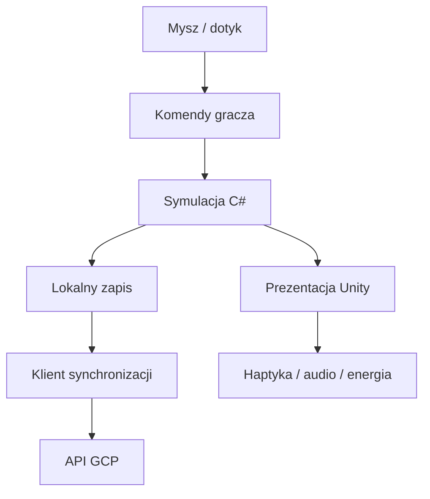
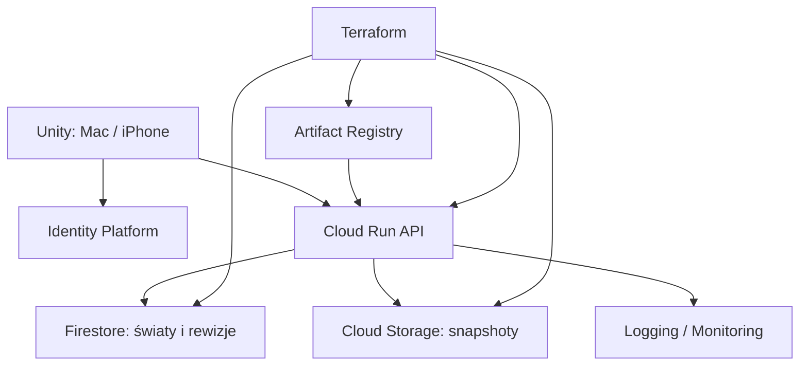

# Plan aplikacji — Nasze Miasteczko

Wersja projektowa 0.2 · 10.09.2026 · gra dla Agi.

**Ten dokument opisuje docelowy produkt.** Aktualny prototyp źródłowy ma mapę 32×32, uproszczone rodziny, 10 celów i implementację synchronizacji. Dokładny zakres wykonania: [IMPLEMENTATION.md](IMPLEMENTATION.md). Kompilacja Unity/Xcode i test GCP pozostają do wykonania na docelowym środowisku.

## 1. Cel i decyzje

Zbudować osobistą grę o tworzeniu miasta, które żyje dzięki swoim mieszkańcom.
Agata gra na Macu M2 i iPhonie 16; preferuje Simsy, wcześniej gry mobilne typu Candy Crush.
Hipoteza produktowa: ładne budowanie, mieszkańcy z charakterem i krótkie cele będą atrakcyjne.
Nie wiemy jeszcze, czy w Simsach ważniejsze są dla niej wnętrza, rodziny czy rozwój — testujemy to w pierwszej sesji.

Zatwierdzone założenia: Unity, Apple jako jedyny target, haptyka i możliwości urządzeń,
serwerowa synchronizacja światów, GCP + Terraform, możliwość instalacji po kablu.
Propozycje do weryfikacji w prototypie: kamera 3D z góry pod kątem, telefon poziomo,
przytulna stylistyka i ekonomia o regulowanej trudności.

W pierwszym wydaniu jedna osoba rozwija dany świat, przełączając urządzenia.
Zapis wspólny na wielu urządzeniach nie oznacza jednoczesnego multiplayera.
Od początku lista wielu niezależnych światów, tworzenie/duplikowanie/archiwizowanie.
Region z wieloma połączonymi miastami to późniejszy etap.

## 2. Pętla rozgrywki

Budujesz okolicę → wprowadzają się rodziny → poznajesz potrzeby i aspiracje →
wybierasz inwestycję/dekorację → oglądasz zmianę życia okolicy → odblokowujesz dalsze możliwości.

Przykład sesji 5 minut: otwórz świat, zobacz prośbę sąsiadki o zielone miejsce spotkań,
postaw ławki i ścieżkę, zobacz mieszkańców korzystających ze skweru, odbierz nową dekorację.
Przykład sesji 45 minut: zaprojektuj dzielnicę, wybierz rodziny, popraw usługi,
ustaw wygląd domów i wykonaj zdjęcie miasta.

Nagrody są kosmetyczne lub poszerzają możliwości budowania. Postęp bez płatnych walut,
energii, reklam, dziennych serii i kar za nieobecność. Opcjonalne zadania nie blokują sandboxa.
Czas symulacji biegnie tylko, gdy świat jest otwarty. Pauza i przyspieszenie 1×/2×/4×.

### Pierwszy grywalny zakres

- Jedna mapa testowa 64×64 pól, płaski teren z dekoracyjną wodą i zielenią.
- Stawianie, obracanie, przenoszenie, burzenie, podgląd kolizji, cofanie ostatniej edycji.
- Drogi/ścieżki na siatce, połączenie budynku z drogą, prosta dostępność usług.
- Około 12 rodzajów budynków/dekoracji: warianty domów, sklep, kawiarnia, park, plac,
  mały zakład/praca, podstawowa usługa miejska, drzewa, ławki, ścieżki.
- 5–10 rodzin z imionami, cechami i trzema czytelnymi potrzebami; panel mieszkańca.
- Podstawowe koszty budowy i utrzymania, przychody, satysfakcja; brak twardej porażki.
- 8–12 ręcznie napisanych próśb/zdarzeń, mała kolekcja odblokowań.
- Pełna obsługa obu urządzeń, autosave, lista światów, synchronizacja i konflikt.
- Haptyka, ustawienia audio/jakości/dostępności oraz prosta kamera fotograficzna.

### Rozwój po pierwszym teście

| Etap | Możliwość | Dlaczego osobno |
|---|---|---|
| 1 | Kolory, fasady, ogrody, gotowe warianty wnętrz | Szybka personalizacja przy ograniczonej produkcji assetów |
| 2 | Wejście do wybranych domów i ustawianie mebli | Osobny system edycji, kamera, kolizje, assety |
| 3 | Relacje, zajęcia i historie rodzin | Więcej stanów i treści do zbalansowania |
| 4 | Region, dzielnice, surowce, turystyka | Wymaga skalowania map i modeli ekonomii |
| 5 | Udostępnianie kopii świata, odwiedziny | Wymaga ACL i czytelnej własności zapisów |
| 6 | Wspólna edycja w czasie rzeczywistym | Osobny protokół multiplayer; obecny sync tego nie zapewnia |

LLM nie jest zależnością rozgrywki. Ręcznie napisane historie i generatory regułowe na start.
Później opcjonalne tworzenie tekstów/briefów budynków poza główną pętlą.

## 3. UX i styl

Wspólna funkcjonalność, osobne układy paneli. Na Macu skróty, precyzyjna mysz/trackpad,
większy panel mieszkańców. Na iPhonie gesty przesuwania i zoomu, duże cele dotykowe,
tryb potwierdzania budowy oraz przyciąganie do pól. Obrót budynku przyciskiem;
obrót kamery gestem opcjonalny, aby nie kolidował z przeciąganiem.

Telefon: poziomo na start. Safe areas, tekst skalowany i kontrast sprawdzane na urządzeniu.
Pauza podczas złożonej edycji, zawsze widoczny przycisk cofnięcia i stan zapisu:
„Na urządzeniu”, „Synchronizuję”, „Zapisano w chmurze”, „Dwie wersje świata”.
Nie pokazujemy toastu przy każdym autosave. Synchronizacja nigdy nie podmienia aktywnego
świata pod palcem; proponuje pobranie w menu lub przy otwieraniu.

Kierunek graficzny: mała makieta, czytelne bryły, miękkie kolory, umiarkowane cienie,
animowane drobiazgi. Assety modułowe z atlasami i wspólnymi materiałami.
W repo ewidencja licencji, źródeł, autorów oraz praw do modyfikacji i dystrybucji.
Najpierw bryły robocze; zakup zestawów po ocenie spójności i kosztu przygotowania.

## 4. Wykorzystanie Apple

| Możliwość | Zastosowanie | Granice i zachowanie awaryjne |
|---|---|---|
| Core Haptics / UIFeedbackGenerator | Delikatne postawienie budynku, inny sygnał błędu, celebracja celu | Wykrywanie wsparcia, wyłącznik i intensywność; bez ciągłych wibracji |
| Metal i ARM64 | Jeden backend graficzny i architektura CPU | Profile jakości per urządzenie, nadal potrzebny profiling |
| Thermal state i Low Power Mode | Redukcja rozdzielczości/cieni, 30 FPS przy oszczędzaniu energii | Histereza, brak skakania jakości, zachowanie tempa symulacji |
| Keychain | Refresh token auth | Żadnych tokenów w PlayerPrefs, logach i save'ach |
| Cykl życia aplikacji | Szybki lokalny checkpoint przy utracie aktywności | iOS może zatrzymać proces; upload przy wznowieniu, bez gwarancji pracy w tle |
| Trackpad / klawiatura | Zoom, obrót, skróty i ergonomiczna edycja na Macu | Haptyka trackpada tylko jeśli wsparta; wzrok i dźwięk wystarczają |
| Dostępność | Duży tekst, ograniczenie ruchu, ikony + kolor + opis | Bez informacji przekazywanej wyłącznie kolorem lub haptyką |
| System share sheet | Eksport zdjęcia i pliku świata | Interakcja inicjowana przez gracza |
| Dźwięk | Reakcja na wyciszenie, przerwanie audio, opcja gry z własną muzyką | Test słuchawki/głośnik, brak przymusowego przejmowania sesji audio |

Apple publikuje pluginy Unity do wybranych frameworków [S1]. Nie zakładamy, że zawierają
wszystko: Keychain, thermal state, Low Power Mode i share sheet mogą wymagać małej
warstwy Swift/Objective-C++ z interfejsem C wywoływanym z C#.
Dobór stabilnej wersji pluginów, zgodnej z wybranym Unity i Xcode, jest zadaniem M0.
Nie zależymy od gałęzi beta. Nie planujemy obsługi czujników bez konkretnej korzyści w grze.

Haptyka: przygotowany silnik, obsługa resetu/stopu, odtwarzanie po wznowieniu;
limit np. 10 drobnych impulsów/s podczas rysowania drogi, pełna celebracja tylko raz na cel.
Wszystkie liczby w tym dokumencie to cele startowe, nie wyniki benchmarków.

## 5. Architektura Unity

Moduły (assembly definitions): `Town.Domain`, `Town.Simulation`, `Town.Presentation`,
`Town.Input`, `Town.Persistence`, `Town.Sync`, `Town.Apple`, `Town.UI`, `Town.Editor`,
`Town.Tests`. Domain nie odwołuje się do UnityEngine.

Dane świata: worldId, schemaVersion, simulationVersion, contentVersion,
mapa/chunki, stabilne ID budynków, rodziny, potrzeby, ekonomia, zadania,
czas symulacji, stan RNG i zasady. Definicje budynków jako ScriptableObjects/asset registry;
w save stabilne identyfikatory, nigdy instanceID Unity ani ścieżki obiektów sceny.
Ustawienia jakości, haptyki i układu UI lokalne per urządzenie. Nazwy/zasady świata synchronizowane.

Komendy walidowane przed zmianą stanu. Cofanie edycji dotyczy określonych operacji budowy,
nie arbitralnego cofania całej symulacji. Transakcja komendy obejmuje pieniądze i budynek.
Ekonomia w jednostkach całkowitych; stałe kroki symulacji, np. 5 Hz dla modeli miasta.
Widok interpolowany niezależnie od tych kroków. Determinizm przydatny w testach, ale sync
oparty na snapshotach, więc nie wymaga identycznej symulacji float między platformami.

Pierwszy model mieszkańców: rodzina jako jednostka ekonomii, pojedyncze postaci dla widoku.
Aktualizacje potrzeb rozłożone w czasie, cache ścieżek i przebudowa grafu tylko po zmianie drogi.
Pula obiektów, instancing, culling; Jobs/Burst po wskazaniu wąskiego gardła przez profiler.
Pełnego ECS nie przyjmujemy jako warunku startu.

### Budżety wydajności do walidacji

- iPhone 16: cel 60 FPS, tryb oszczędny 30 FPS. Mierz medianę i p95 czasu klatki.
- Testy 20–30 minut w normalnej temperaturze, dodatkowo Low Power Mode i nagrzanie.
- Mapa testowa 64×64, scenariusz obciążenia 128×128 i 500 budynków jako test, nie obietnica pojemności.
- Startowy cel pamięci iPhone: poniżej 1 GB użycia procesu w scenie obciążeniowej; sprawdzić peak przy zapisie.
- Brak cyklicznych alokacji w gorącej ścieżce; snapshot w spójnym ticku, kompresja poza głównym wątkiem.
- Lokalny checkpoint co 30 s zmian i przy istotnych operacjach; chmura najczęściej co 120 s,
  przy świadomym „Zapisz i wyjdź” oraz po odzyskaniu połączenia. Kolejka łączy nadmiarowe snapshoty.
- Granice uploadu MVP: 8 MiB skompresowane / 16 MiB po rozpakowaniu. Większy świat wymaga
  późniejszego protokołu chunków; komunikat gracza nie może prowadzić do utraty lokalnego save'a.

## 6. Zapisy i synchronizacja

Symulacja lokalna. Serwer jest autorytetem dla właściciela, historii i głównej wersji świata,
nie dla każdej decyzji mieszkańca. Internet wymagany do pierwszego logowania i synchronizacji;
nowy lokalny świat można stworzyć bez niego i przypisać do konta później.
Pełny protokół: [SYNC-PROTOCOL.md](SYNC-PROTOCOL.md).

Kluczowe niezmienniki: potwierdzony save wskazuje istniejący, sprawdzony blob;
nie nadpisujemy nowszej wersji; retry nie tworzy duplikatów; konflikt nie usuwa żadnej gałęzi;
zmiana konta nie wysyła lokalnego świata poprzedniego właściciela.
Zegar urządzenia nie rozstrzyga kolejności zapisów. Serwerowa rewizja/rodzic rozstrzyga konflikt.

## 7. GCP

Domyślny region `europe-west1` dla compute, Firestore i bucketów. Zmiana na Warszawę możliwa
przed utworzeniem danych; lokalizacja Firestore to decyzja trudna do odwrócenia.
Dwa osobne projekty na dev/prod po uzyskaniu grywalności; teraz jeden prywatny dev.
Istniejący projekt z billingiem przekazany jako zmienna. Pakiet nie tworzy organizacji ani billing account.

| Zasób | Rola | Konfiguracja startowa |
|---|---|---|
| Cloud Run | Bezstanowe API TypeScript/Node | min 0, max 2, 1 CPU / 512 MiB, request-based billing, 60 s timeout |
| Firestore Native `(default)` | Właściciele, head, rewizje, idempotencja | Dostęp backendem, reguły klienta deny-all |
| GCS worlds | Nieprzepisywane snapshoty | Private, UBLA, public access prevention, soft delete 7 dni |
| GCS tfstate | Stan Terraform | Versioning, prevent_destroy, ograniczony IAM |
| GCS build-source | Paczki Cloud Build | Prywatny, usuwanie źródeł po 14 dniach |
| Artifact Registry | Obrazy API | Docker, regionalny; politykę retencji wdrożeń ustalić przed regularnym CI |
| Identity Platform | Logowanie email + hasło | REST dla obu buildów Unity, bez SMS i anonimowego auth |
| IAM | Tożsamość API i buildera | Osobne konta usług, bez pobieranych kluczy JSON |
| WIF opcjonalnie | GitHub OIDC → konto buildera | Ograniczenie numeric owner/repo ID oraz refs/heads/main |
| Billing budget | Alarm kosztów | Próg domyślny 10 EUR/miesiąc; waluta musi odpowiadać billingowi |

Cloud Run może zejść do zera [S4]. Nie używamy stałego serwera, Cloud SQL, GKE,
VPC connectora, NAT ani load balancera. Standardowy HTTPS `run.app` wystarcza na start.
Publiczny transport Cloud Run jest konieczny dla mobilnych tokenów aplikacyjnych;
autoryzacja w API sprawdza token użytkownika i UID allowlist. Brak auth = brak dostępu do danych.
Terraform uruchamia Cloud Run dopiero po `enable_api=true` i podaniu obrazu przez digest.
API TypeScript obsługuje synchronizację i ma adaptery Firestore/GCS. Testy domenowe i HTTP przeszły; wdrożenie oraz test IAM i rzeczywistych tokenów pozostają wymagane.

### Auth i ochrona danych

Managed Identity Platform przez REST [S7], bez zależności od desktopowego SDK Firebase Unity.
Admin zakłada konta testerów, a ich UID trafiają na allowlist API. Brak publicznego formularza
rejestracji. Terraform wyłącza rejestrację użytkowników przez REST. Allowlist pozostaje dodatkową kontrolą
dostępu API; nie traktujemy ukrycia UI jako zabezpieczenia.
Logowanie/rest refresh z UnityWebRequest; access token w pamięci, refresh w natywnym Keychain.
API weryfikuje podpis, issuer, audience, expiry i zablokowanie użytkownika oraz dostęp do świata.
Nie używamy wspólnego hasła serwerowego zaszytego w aplikacji.
API key Identity Platform jest publicznym identyfikatorem klienta, ograniczonym do właściwych API;
nie jest tokenem autoryzującym odczyt światów. Terraform state nadal chroniony.

Dostęp do Firestore wyłącznie kontem API, reguły mobilne deny-all. Blob niepubliczny, bez
URL-i zawierających długowieczne tokeny. API odczytuje dane przez tożsamość runtime (ADC).
Uprawnienie datastore.user na projekt akceptowalne w dedykowanym projekcie tej gry.
API ma create/get/list do snapshotów, ale bez delete/overwrite; GC osobnym kontem w późniejszym etapie.

Limity serwera: 10 światów/konto, 1 upload jednocześnie na świat, rozmiar gzip i rozpakowany,
limit liczby obiektów i pól, 120 commitów/dobę/konto na start. Liczniki trwałe, nie tylko w pamięci
Cloud Run. Retry z backoff+jitter, 429 z Retry-After. Nie logować treści save'a ani tokenów.
Metadane osobowe minimalne; nazwy mieszkańców mogą być prywatne, nie trafiają do logów.

### Koszty i utrzymanie

Budżet projektowy dla 2 testerów: **kilka EUR miesięcznie jako rezerwa**, nie gwarantowana wycena.
Compute może kosztować 0 przy braku żądań; storage, historia, soft delete, obrazy,
buildy i transfer mogą generować opłaty również bez aktywnej gry. Darmowe limity bywają
współdzielone między projektami billing account [S8]. Firestore ma opłaty także za backup/PITR [S9].

Przykład wolumenu: 2 graczy × 1 h/dzień × 30 snapshotów/h × 30 dni × 2 MiB = około
3.5 GiB nowych snapshotów miesięcznie przed retencją; każdy download dodatkowo transfer.
To pokazuje, dlaczego lokalny autosave i upload do chmury muszą mieć różne częstotliwości.
Koszt modelować: GiB-miesiąc danych + GiB pobrań + operacje GCS/Firestore + CPU/RAM API
+ przechowywane obrazy i minuty buildów. Cenniki [S8–S10]; przeliczyć przed apply w wybranym regionie.
Alarm budżetowy nie zatrzymuje wydatków. max_instances nie jest twardym limitem kosztów.

Retencja aplikacyjna: najnowsza rewizja zawsze, ostatnie 20 oraz dzienne checkpointy przez 30 dni,
konflikty do decyzji gracza. W tym starterze **nie ma GC usuwającego snapshoty**. Nie stosować
lifecycle po samym wieku dla live world blobs — skasowałoby save nieaktywnego gracza.
Przed dłuższą eksploatacją wdrożyć GC sprawdzający referencje i opóźnione usuwanie.
GCS soft delete chroni przed pomyłką, nie zastępuje kopii metadanych Firestore.
MVP: lokalne kopie + ręczny eksport. Przed produkcją: Firestore scheduled backups/PITR,
próba odtworzenia do osobnego środowiska i udokumentowane RPO/RTO.

Operacje: structured logs requestId/worldId/revisionId, metryki 5xx, p95 czasu API,
czas synchronizacji, konflikty, odrzucone uploady, rozmiary save'ów. Terraform obejmuje
alert 5xx bez kanału powiadomień; przypięcie kanału po wyborze odbiorcy. Nie używać
ciągłych pingów health w małym dev, jeśli celem jest ograniczenie wybudzeń.

## 8. Repo i buildy

Jedno repo: `apps/game` (Unity), `apps/sync-api`, `infra`, `scripts`, `docs`.
Tekstowe YAML Unity i Visible Meta Files, Git LFS dla dużych źródeł grafiki/audio.
CI Linux: skrypty, kontrakt API, testy domeny/serwera, terraform fmt/validate.
Mac ARM64: Unity/Xcode, licencja Editor, podpisywanie i pomiary urządzeń.
Własny zaufany runner Mac przez ręczne workflow; nigdy wykonywanie niezaufanych PR na
runnerze mającym dostęp do Keychain. Unity build nie uruchamia się na Cloud Run.
Cloud Build służy wyłącznie do linuksowego obrazu API; build iOS wymaga macOS/Xcode [S2].

Build development (profiler) i release-like (bez debug narzędzi) różnią się flagami Unity,
nie koniecznie rodzajem podpisu Apple. Pomiar wydajności na release-like podpisanym dewelopersko.
Darmowe konto Apple wystarczy do lokalnych testów, ale podpis wygasa po 7 dniach [S3].
Backend GCP działa również w tej wersji; nie wymaga iCloud/Game Center ani płatnych capability.
Haptykę testować na fizycznym iPhonie. Wtyczki wybierać tak, by nie narzucały zbędnych entitlementów.

## 9. Etapy i bramki odbioru

Orientacyjne nakłady: dni skoncentrowanej pracy jednej osoby, przy gotowych assetach;
nie jest to termin zobowiązujący. Jakość treści i animacji może znacząco zwiększyć zakres.

| Etap | Nakład orientacyjny | Wynik i bramka |
|---|---|---|
| M0: platformy | 2–4 dni | Scena na M2 i iPhone 16; kabel, release-like, logi, haptyka, pin toolchain |
| M1: budowanie | 5–8 dni | Mapa, kamera, drogi, 12 elementów, kolizje, cofanie, lokalny save |
| M2: życie i cele | 5–10 dni | Rodziny, potrzeby, ekonomia i 8–12 próśb; Aga gra 20 min bez pomocy |
| M3: GCP i sync | 4–8 dni | Auth, Terraform, konflikt, idempotencja, migracje; Mac ↔ iPhone bez strat |
| M4: dopracowanie | 5–10 dni | Grafika/audio, 30 min profiling, dostępność, backup/restore, stabilny build |

Razem rząd wielkości 21–40 dni inżynierskich dla ograniczonego MVP; pełne wnętrza,
zaawansowane AI mieszkańców i multiplayer nie mieszczą się w tym oszacowaniu.
Techniczny spike synchronizacji w M0: dwa klienty testowe i konflikt zapisu przed pracą nad UI.
Nie trzeba czekać na gotową grafikę, żeby sprawdzić najtrudniejsze ryzyko danych.

Pierwszy test z Agą: obserwuj co robi dobrowolnie — dekoruje, śledzi rodziny czy optymalizuje.
Nie zakładaj, że powrót codziennie jest celem. Pytanie po sesji: „Co chciałabyś zrobić dalej?”.

## 10. Strategia testów

- Domena: koszt budowy atomowy, zasoby nieujemne, drogi i dostępność, potrzeby, deterministyczne seed fixtures.
- Persistence: roundtrip, checksum, uszkodzony zapis, atomic replace, przerwanie zapisu,
  migracja dwóch poprzednich schemaVersion, brakujące content ID, nowszy zapis na starszym kliencie.
- Serwer: obcy UID, brak/expired/revoked token, limit rozmiaru, gzip bomb, równoczesny commit,
  replay tego samego idempotency key, crash między GCS a Firestore, tombstone vs stary offline klient.
- Integration: emulator dla transakcji i odrębny GCP dev dla rzeczywistego IAM/auth/storage.
  Emulator nie dowodzi poprawności IAM ani kosztów.
- Unity PlayMode: dotyk i mysz, placement, pause, autosave, brak zatrzymania renderowania podczas kompresji.
- Urządzenia: force quit, airplane mode, background/foreground, wygaśnięcie podpisu i reinstalacja
  bez usuwania kontenera danych, Low Power Mode, audio interruption, 30 min obciążenia.
- Odbiór sync: zbuduj na Macu → zapisz → otwórz identyczny świat i czas na iPhonie;
  następnie rozgałęź offline i sprawdź obie kopie oraz świadomy wybór użytkownika.

## 11. Rzeczy do uzupełnienia przed pierwszym uruchomieniem

Nazwa i bundle ID, wersje macOS/iOS oraz Xcode, dokładny Unity patch, RAM Maca,
Apple Team ID, UDID urządzenia, GCP project ID z billingiem, dane kont testerów,
publiczny API key Identity Platform, obraz API przez digest. Są to parametry konfiguracji;
nie blokują przygotowania repo. Przed wdrożeniem implementacji: endpointy API i wymagane testy
z M3 muszą przejść na wdrożonym środowisku — same testy pamięciowe i `/healthz` nie wystarczą.

## Źródła techniczne

Stan dokumentacji sprawdzany 10.09.2026; wartości wydajności i wybory produktowe to własne propozycje.

- [S1 Apple Unity Plug-Ins](https://github.com/apple/unityplugins)
- [S2 Unity — proces budowania iOS](https://docs.unity3d.com/6000.0/Documentation/Manual/iphone-BuildProcess.html)
- [S3 Apple — Personal Team i ograniczenia podpisu](https://developer.apple.com/help/account/basics/about-your-developer-account)
- [S4 Cloud Run — minimum instances](https://cloud.google.com/run/docs/configuring/min-instances)
- [S5 Firestore — transakcje](https://cloud.google.com/firestore/native/docs/manage-data/transactions)
- [S6 GCS — generation preconditions](https://cloud.google.com/storage/docs/request-preconditions)
- [S7 Auth REST API](https://firebase.google.com/docs/reference/rest/auth)
- [S8 Cloud Run pricing](https://cloud.google.com/run/pricing)
- [S9 Firestore pricing](https://cloud.google.com/firestore/pricing)
- [S10 Cloud Storage pricing](https://cloud.google.com/storage/pricing)
- [S11 Workload Identity Federation](https://cloud.google.com/iam/docs/workload-identity-federation-with-deployment-pipelines)
- [S12 Unity command line](https://docs.unity3d.com/6000.0/Documentation/Manual/EditorCommandLineArguments.html)
